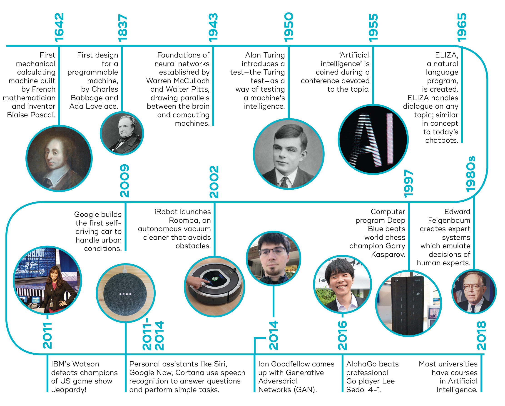
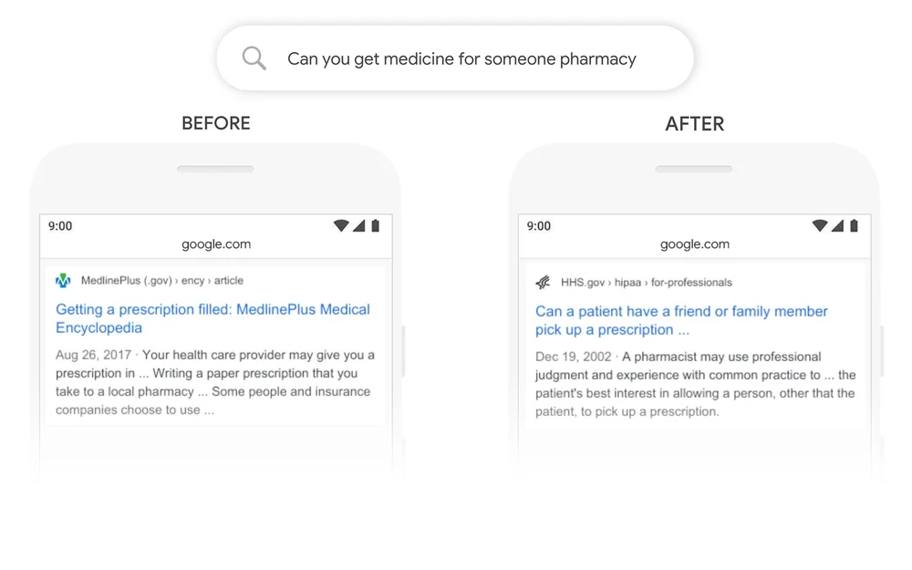

# Artificial Intelligence

Artificial intelligence (AI) refers to computer systems capable of performing complex tasks that historically only a human could do, such as reasoning, making decisions, or solving problems. 

However, decades before the current definition, the birth of artificial intelligence conversation was marked by Alan Turing's groundbreaking work, ["Computing Machinery and Intelligence"](https://redirect.cs.umbc.edu/courses/471/papers/turing.pdf), published in 1950. In this paper, Turing, often referred to as the "father of computer science", poses a question: "Can machines think?" He then proposes a test, now famously known as the "Turing Test". This test involves an interrogator attempting to differentiate between a human and a machine's text response. Although this test has faced much criticism since its publication, it remains an essential part of AI history and continues to be a topic within philosophy due to its focus on linguistics.

Today, more than 70 years after Turing’s proposal, no AI has managed to successfully pass the test by fulfilling the specific conditions he outlined. Nonetheless, as some headlines reflect, a few systems have come quite close. You can read more about it in this [article](https://theconversation.com/ai-is-closer-than-ever-to-passing-the-turing-test-for-intelligence-what-happens-when-it-does-214721).

# History of AI

Although the modern AI has started at 1950s, it is the last twenty years, we see a lot of improvements and products as a consumer. Here are a few big milestone of AI in last twenty years.

**2001**: Machine learning helps Google Search users correct their spelling.

**2006**: Google Translate launches

**2010**: Microsoft launched Kinect for Xbox 360 with the award-wining machine learning model for human motion capture.

**2011**: IBM's Watson computer defeated television game show Jeopardy!

**2011-2014**: Voice assistant from Apple (Siri), Google (Google Now) and Microsoft (Cortana) were released.

**2015**: Google released Tensorflow, an open-sourced AI and machine learning platform.

**2015**: OpenAI was founded.

**2016**: AlphaGo defeats world champion Go player.

**2016**: Pytorch was released. An AI and machine learning development platform.

**2017**: Google Research introduces the Transformer model architecture. This model revolutionises natural language processing (NLP) applications and the foundation of today's large language models (llm).

**2019**: Natural language understanding helps Google to search better.

**2020**: AlphaFold solves the protein-folding problem.

**2020**: OpenAI introduces GPT-3 model.

**2022**: OpenAI launches ChatGPT.

**2023**: Google launches Google BARD.

# References

- What is Artificial Intellience? Click [here](https://www.ibm.com/topics/artificial-intelligence) to access. (Accessed: 23rd Nov 2023)
- What Is Artificial Intelligence? Definition, Uses, and Types. Click [here](https://www.coursera.org/articles/what-is-artificial-intelligence) to access it. (Accessed: 23rd Nov 2023)
- AI is closer than ever to passing the Turing test for ‘intelligence’. What happens when it does? Click [here](https://theconversation.com/ai-is-closer-than-ever-to-passing-the-turing-test-for-intelligence-what-happens-when-it-does-214721) to access it. (Accessed: 23rd Nov 2023)
- History of Artificial Intelligence. Click [here](https://qbi.uq.edu.au/brain/intelligent-machines/history-artificial-intelligence) to access. (Accessed: 23rd Nov 2023)
